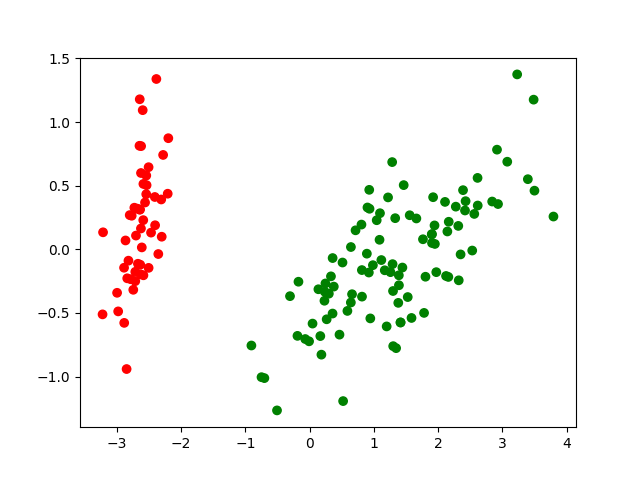

University of Science and Technology Hanoi

BI12 - 074 Doan Dinh Dang

Information and Communication Technology

# Classification I

## K-Nearest Neighbor classification

### K-NN on [Iris](http://archive.ics.uci.edu/dataset/53/iris) dataset with no preprocessing technique

- Applying kNN algorithm with _k = 10_ on iris dataset with 70% train data and 30% train set, we have this confusion matrix of 3 classes: "**Setosa**, **Versicolor**, **Virginica**":

$$
\begin{pmatrix}
& Setosa & Verisicolor & Virginica \\
Setosa & 16 & 0 & 0 \\
Versicolor & 0 & 17 & 1 \\
Virginica & 0 & 0 & 11
\end{pmatrix}
$$

- As we can see, with k = 10, kNN still predict 1 sample different from the test set (true value is **Verisicolor** but predicted value is **Virginica**).

- After change _k_ from 3 to 10, the classification still remained the same (i haven't applied any preprocessing technique).

### Normalization

- After applying preprocessing technique **Normalization**, with _k = 10_, kNN reduce its performance. The prediction now shows that it predict wrong 2 Versicolor sample.
- This is the confusion matrix of kNN with k = 10 after Normalization:

$$
\begin{pmatrix}
& Setosa & Verisicolor & Virginica \\
Setosa & 16 & 0 & 0 \\
Versicolor & 0 & 16 & 2 \\
Virginica & 0 & 0 & 11
\end{pmatrix}
$$

- Normalization is the technique to bring all features to the same range, that may increase the performance of classification because the data points are now "closer".
- But in this dataset, the **Virginica** samples and **Versicolor** samples may vary a lot, so even the _Normalization_ technique perform not effectively or even worse. In addition, Iris dataset has only 150 instances, so the data are not enough and not too various that _Normalization_ can help kNN perform well.

### PCA (Principle Components Analysis)

- Applying PCA of 2 components on Iris dataset still give the same result as _Normalization_. This technique stil give the same result as _Normalization_ technique or non technique.
- Confusion matrix of kNN with k = 1= after applying PCA of 2 components:

$$
\begin{pmatrix}
& Setosa & Verisicolor & Virginica \\
Setosa & 16 & 0 & 0 \\
Versicolor & 0 & 17 & 1 \\
Virginica & 0 & 1 & 10
\end{pmatrix}
$$

- PCA is the technique reducing dimensions of dataset help the classification improve the performance. However, Iris data set is too clean and reach the perfect conditions of a dataset used for classification. Therefore, even applying PCA cannot improve the performance of kNN any more.

### Leave-one-out cross-validation

- Applying leave-one-out technique for kNN on iris dataset also gives a very good performance.
- The accuracy of model after applying leave-one-out is calculate by **Mean Square Error (MSE)**. In classification problem of iris dataset, MSE is the percentage of observations correctly classified during the _n_ repeated model fittings.
- **MSE** of Iris dataset with kNN is **0.973(3)** and **Standard Deviation** is **~0.1611**. This shows that the kNN still perform very well after applying _leave-one-out_ technique.

## Perceptron Classifier

- Initialize values for weight vector $w = [0, 0]$ and learning rate $\alpha = 0.1$.

- Applying PCA of components 2:

- By applying the Perceptron classifier with PCA of components 2, the prediction performs very well with the accuracy **1.00** (classify perfectly).

- This is the confusion matrix of Perceptron on Iris dataset with 70% train data:

$$
\begin{pmatrix}
16 & 0 \\
0 & 29
\end{pmatrix}
$$

- The Perceptron algorithm is a linear classification algorithm used to classify the data into two classes. The algorithm performs by iteratively updating the weights of the input features until the model converges. The convergence depends on the learning rate and data distribution. The Perception classifier is guaranteed to converge if the data is linearly separable, or else it may not converge.
- For the Iris dataset, all the features is linearly continuous, so the algorithm will definitely converge.
- In order to make the algorithm converge faster, reducing learning rate one of the easiest method. Smaller learning rate can help the algorithm take smaller steps towards the optimal weights, and help the algorithm converge faster. In addition, we can also applying some preprocessing method to make the dataset more clean (less noise, low variance, low scaler) for example Normalization, Standardize, PCA, leave-one-out cross-validation, K-fold, ....

## Usage source

- Source code use for calculating and plotting:

`https://github.com/dangdd2003/Classification-Technique.git`
