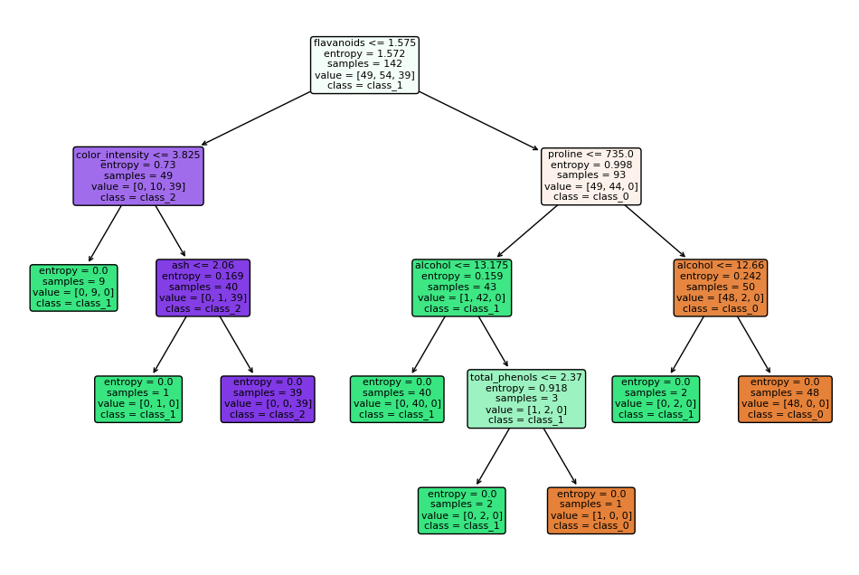

University of Science and Technology Hanoi

BI12 - 074 Doan Dinh Dang

Information and Communication Technology

# Classification II

## Decision Tree - DT

- To make the classification with **Decision Tree**, fist we will select a dataset with available labels. Let's choose [Iris](https://archive.ics.uci.edu/dataset/53/iris) dataset for example.
- First we will split iris dataset into two subsets: one for training and one for testing. We will use 80% of data for training and 20% for testing.
- Then we will use "tree" package from the Sklearn library in Python to make the prediction, calculating the necessary metrics, and building the decision tree. The splitting rule of decision tree will be considered by calculating _information gain_ from _Entropy_ of each child node.
- Building the decision tree

- Confusion Matrix:

  $$
  \begin{pmatrix}
  & setosa & versicolor & virginica \\
  setosa & 11 & 0 & 0 \\
  versicolor & 0 & 5 & 1 \\
  virginica & 0 & 0 & 13
  \end{pmatrix}
  $$

- Accuracy Score: ~ 96,67%
- As we know that, **iris** dataset is a very clean dataset, so for any classification method, we still get a very good result on prediction. Only one sample of _versicolor_ was wrongly predicted to be _virginica_.

## Random Forests

- For the classification with **Random Forests**, we will choose a dataset with larger features (dimensions). Let's choose [Wine](https://archive.ics.uci.edu/dataset/109/wine) dataset for example. _Wine_ dataset has a total of features 13 _quantitative_ features and 178 instances divided into 3 types of wines.
- As we know that, **Random Forests** classification is also **Decision Tree** classification, but it aims to prevent the model from overfitting, and improve the prediction performance.
- The algorithm fit on a slightly different training set, and in turn, has a slightly different performance by applying _bagging technique_ (bootstrap aggregation) or many other preprocessing techniques to make the training dataset very for every time splitting the data.
- Here, we are going to apply **Random Forest** by preprocessing dataset with _bagging technique_ and then applying **Decision Tree**. Then, we will compare the result with applying _pure_ **Decision Tree** to see the difference in performance.

### Bagging with k = 100 training set + Decision Tree (Random Forests)

- Here, we use the library sklearn to perform this technique, and calculate the necessary metrics. The process is as follows:
  - Applying bagging technique with k = 100 training set.
  - Building the decision tree for every dataset in 100 datasets. Then, we will have 100 decision trees, so it is impossible to visualize all of them.
  - For testing test data, we will take the majority vote of all 100 decision trees to make the final prediction.
- Confusion Matrix:

$$
\begin{pmatrix}
& wine_1 & wine_2 & wine_3 \\
wine_1 & 15 & 0 & 0 \\
wine_2 & 0 & 13 & 0 \\
wine_3 & 0 & 0 & 8
\end{pmatrix}
$$

- Accuracy: 100%

### Pure Decision Tree

- Building the decision tree

- Confusion Matrix:

$$
\begin{pmatrix}
& wine_1 & wine_2 & wine_3 \\
wine_1 & 10 & 0 & 0 \\
wine_2 & 2 & 15 & 0 \\
wine_3 & 0 & 0 & 9
\end{pmatrix}
$$

- Accuracy Score: ~ 94.44%

### Conclusion

- As the result, _pure_ **Decision Tree** has lower performance compare to **Random Forests** where the accuracy score is 94.44% and 100% respectively. This is because **Random Forests** is an ensemble of decision trees, which can increase the accuracy of the model, and robust to outliers and noise.
- In addition, with bagging technique, every time the **Decision Tree** will train on slightly different dataset, that will reduce the overfitting problem, and improve the performance.

## Note

- Performing the **Decision Tree** require slicing (or splitting) the datasets many times in order to find the best _information gain_, so the visualization may different every time we train the model. But it will still give us the same result, even though the built tree is different.
- The splitting rule for all above visualization and prediction is set to _best_ by default in sklearn library.

## Resource

- This is the [repository](https://github.com/dangdd2003/Classification-Technique.git) of the python code that i used for visualization and classification:

`https://github.com/dangdd2003/Classification-Technique.git`
